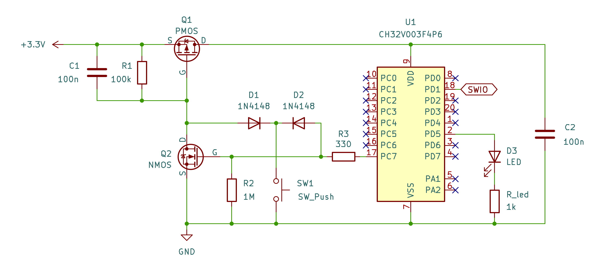

# CH32V003 Soft Latching Power Circuits

The Soft Latching Power Circuit is ideal for battery-powered applications, as it draws no current once the system is powered down.

## Schematic

- `R1` and `C1` hold `Q1` in the off state, while `R2` keeps `Q2` turned off.
- Pressing the button `SW1` pulls the gate of `Q1` low, allowing power to reach the MCU.
- Once powered, the MCU configures `PC7` as an input with the internal pull-up resistor, which latches both `Q1` and `Q2` on.
- The MCU can also monitor the state of the button through pin `PC7`.
- To shut down the circuit, the MCU configures `PC7` as an input with the internal pull-down resistor, turning off both `Q1` and `Q2`.

## Notes

The circuit works flawlessly with the CH32V003!

Initially, I tested it with the CH552, but it never operated reliably. This is likely due to the CH552’s GPIOs defaulting to quasi-bidirectional mode (typical for 8051 cores), which includes an internal pull-up resistor. As a result, `Q2` may not be fully turned off. In contrast, the CH32V003 GPIOs default to high-impedance input mode, which avoids this issue.

## References

- [Andrew Levido: Soft Latching Power Circuits](https://circuitcellar.com/resources/quickbits/soft-latching-power-circuits/)
- [CNLohr: ch32v003fun](https://github.com/cnlohr/ch32v003fun)
- [A Guide to Debouncing](https://my.eng.utah.edu/~cs5780/debouncing.pdf)
- [The simplest button debounce solution](https://www.e-tinkers.com/2021/05/the-simplest-button-debounce-solution/)
- [Museum of the Game - Let's design some POKEY replacements](https://forums.arcade-museum.com/threads/lets-design-some-pokey-replacements.515774/post-4623716)
