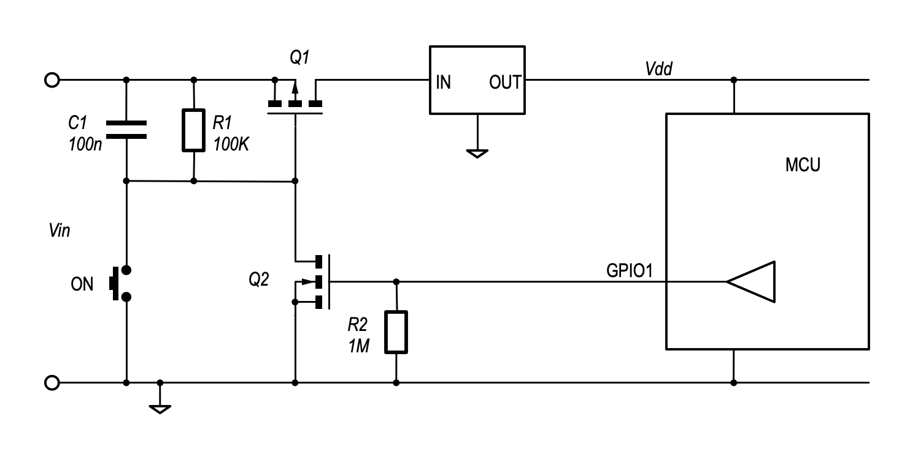

# CH32V003 Soft Latching

## Schematic

- GPIO `PA1` connects to the gate of `Q2`.
- GPIO `PC1` connects to an LED as an indicator.
- No LDO.

(TODO: the actual schematic)

## References

- [Andrew Levido: Soft Latching Power Circuits](https://circuitcellar.com/resources/quickbits/soft-latching-power-circuits/)
- [CNLohr: ch32v003fun](https://github.com/cnlohr/ch32v003fun)
